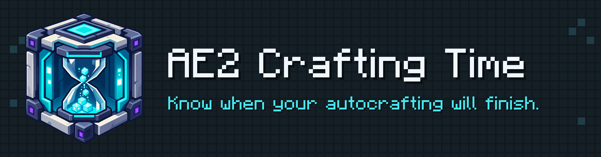

  Time estimates, progress tracking, and bottleneck diagnostics for 
  Applied Energistics 2.

  
  
  

  
  

## See what your craft is waiting for

  

  Remaining-time estimates and delayed recipes, directly in AE2. 
  <a href="docs/images/README.md">See the screenshot gallery</a>

## From planning to troubleshooting

| 01 Estimate your craft | 02 Track progress | 03 Diagnose delays |
| --- | --- | --- |
| See timing estimates before starting. | Follow remaining time as work runs. | Find stalled recipes and bottlenecks. |

More features and integrations

- Remembers how long your crafts really take, so its time guesses get better the
  more you play.
- Tells you how long a craft will take — for one item or a whole job — right on
  the AE2 screens, so you know when to come back.
- Marks scheduled work as waiting until its first pattern dispatch, so you can
  tell that it hasn't started yet.
- Alerts you when a craft has stalled, so you can fix it instead of waiting
  forever.
- Shows what's slowing you down — like a machine that's too slow, too few
  Pattern Providers, or not enough Crafting Co-Processors — and how to speed it
  up.
- Shows how close its time guesses were after a craft finishes, so you can trust
  the numbers.
- Adds time, colors, totals, and sort buttons to the AE2 crafting screens, so the
  info is easy to read at a glance.
- Lets you Ctrl-Alt-click an entry to erase old, wrong stats for that item.
- Works with Applied Mekanistics chemicals, and adds time hints to ME Requester
  rows and totals, when those mods are installed.
- Only shares summary stats with other players on the server — never your items
  or your base.
- Keeps what it learned inside your world, so it stays smart after you quit and
  come back.

## Downloads & compatibility

Choose your Minecraft version and loader on the download page.

[Supported versions, dependencies, and optional integrations](docs/dependencies.md)

## Documentation

[Player controls](docs/player-controls-and-integrations/spec.md) ·
[Screenshot gallery](docs/images/README.md) ·
[Building](docs/building.md) ·
[Contributing](docs/working-with-project.md)

[Report a bug](https://github.com/cTux/ae2-crafting-time/issues) ·
[Ask a question](https://github.com/cTux/ae2-crafting-time/discussions)

All technical documentation

- [Building It](docs/building.md)
- [Running a Development Client](docs/dev-client.md)
- [Automated UI testing](docs/automated-ui-testing/spec.md)
- [UI test-driver mod](docs/test-driver/spec.md)
- [Repo Layout](docs/repo-layout.md)
- [Working with this project](docs/working-with-project.md)
- [Codex Skills](docs/codex-skills.md)
- [Dependencies and integrations](docs/dependencies.md)
- [Client and modpack coverage](docs/mod-automation-coverage.md)
- [Known Issues](https://github.com/cTux/ae2-crafting-time/issues?q=is%3Aissue%20is%3Aopen%20label%3Abug)
- [Architecture](docs/architecture.md)
- [Feature documentation map](docs/feature-coverage.md)
- [Profiling and diagnostics](docs/profiling-and-diagnostics/spec.md)
- [Player controls and integrations](docs/player-controls-and-integrations/spec.md)
- [AE2 addon integration](docs/ae2-addon-integration/spec.md)
- [Release process](docs/release.md)
- [Server-owned stats design](docs/server-client-stats.md)
- [World save persistence](docs/world-save-persistence.md)
- [Time To Craft plan UI](docs/time-to-craft-plan.md)
- [TTC sorting](docs/ttc-sorting.md)
- [TTC colored text](docs/ttc-colored-text.md)
- [Waiting to start status](docs/waiting-to-start/spec.md)
- [Provider locate](docs/provider-locate/spec.md)

Project health and download statistics

Development disclosure

Yes, AI helps me write this mod. I'm not really a Java guy, if you know what I
mean, but I have enough engineering experience to keep it from turning into
vibe-coded spaghetti. I direct and review the work, and I expect the code to be
tested, maintainable, scalable, and reusable. I hope that makes it clear where
AI fits into the project.

The mod does not use generative AI while running and does not include
AI-generated in-game visual assets. The README branding is separate.

---

  Unofficial addon. Not affiliated with or endorsed by the Applied Energistics 2 team. 
  Available under the <a href="LICENSE">MIT License</a>.

