# Screenshot gallery

These crops come from UI smoke testing on **Project Infinity 0.0.52.0**
(Minecraft 1.20.1, Forge 47.4.20, AE2 15.4.10). JPEGs focus on the relevant
rows, estimates, or complete tooltip. Click an image to inspect its native size.
The book uses larger exports of the same crops to keep its text readable.

## Crafting plan

Before any timing history exists:

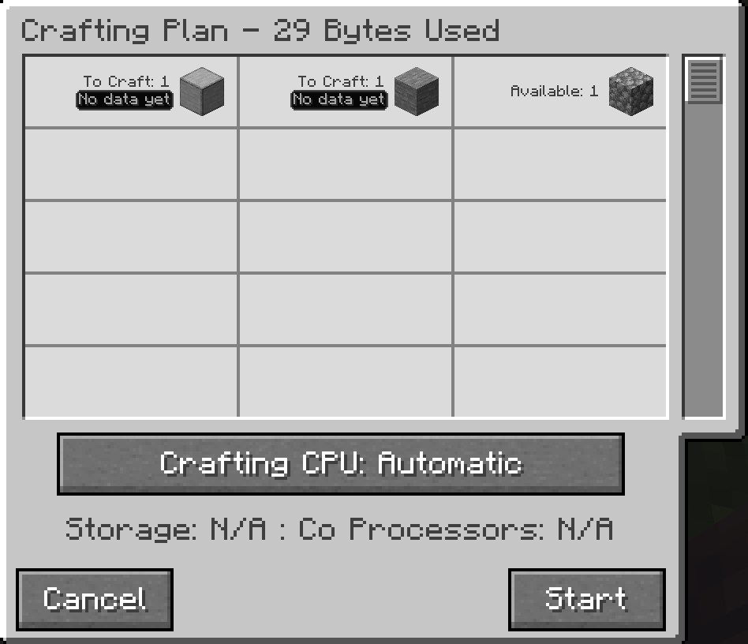

With timing history available:

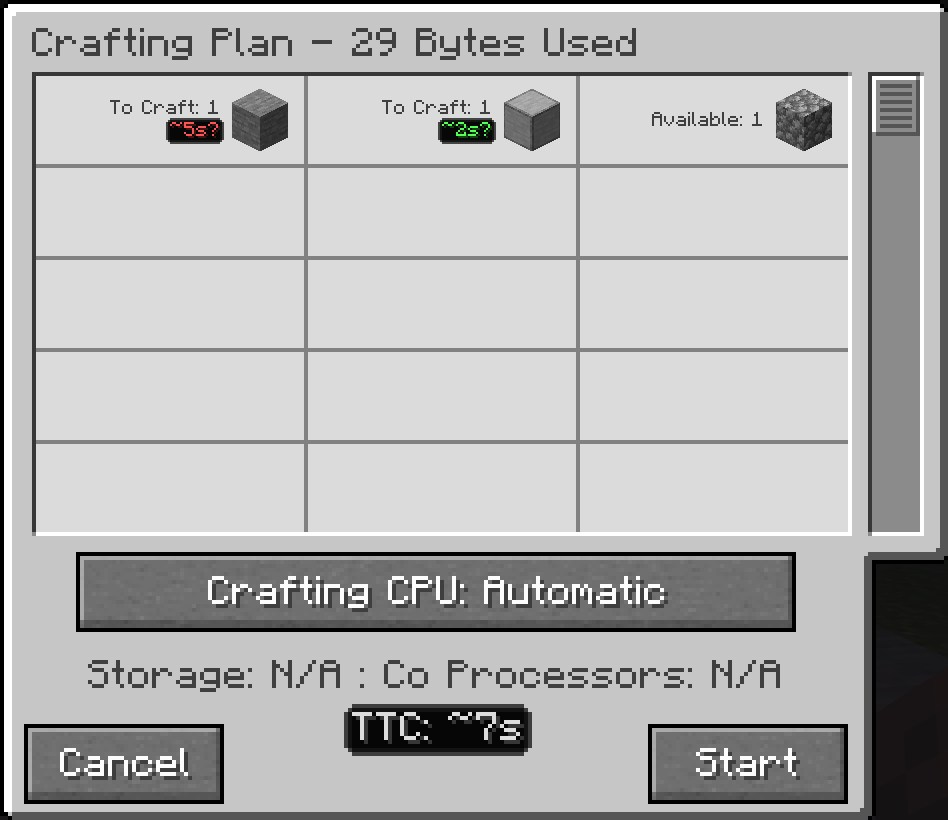

When only part of the plan has history, the total covers the known work:

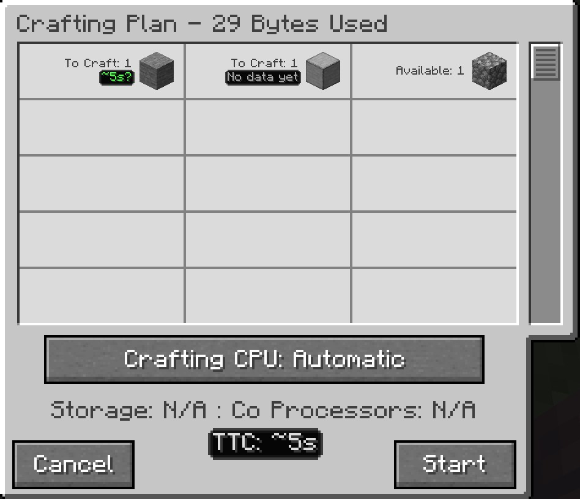

## Live crafting status

Active recipes, scheduled work, and the remaining-time estimate:

Scheduled work waits for its ingredient to finish:

The delayed state after a processing machine stops producing output:

Hovering the delayed recipe shows its timing, recent activity, and advice:

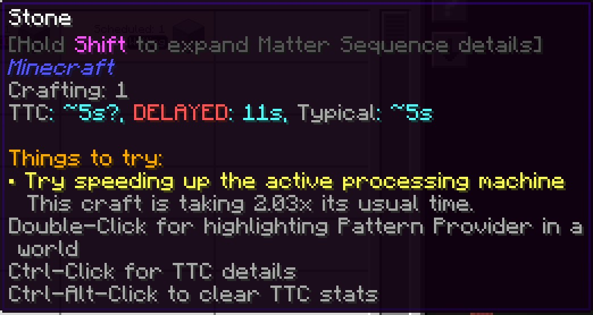

When the CPU can't return its stored items to the ME network, the row explains
the problem and suggests freeing or adding storage:

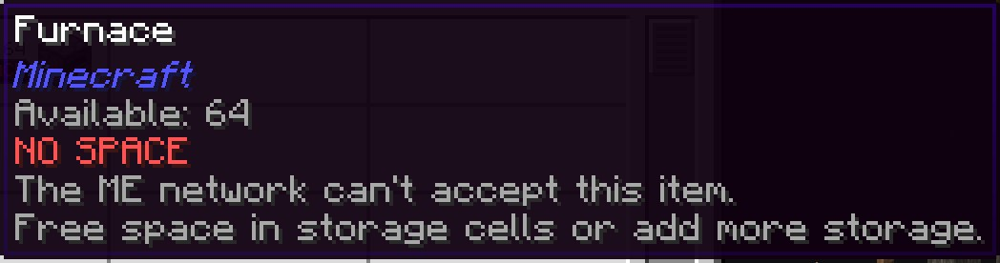

When scheduled work loses its connected Pattern Provider or encoded pattern,
the row shows NO PROVIDER and explains how to resume the job:

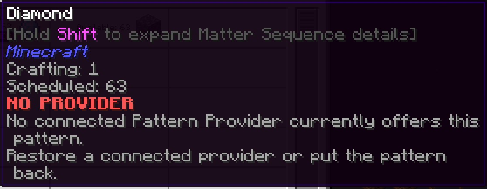

When the ME network can't supply enough energy to dispatch the next pattern,
the row shows NO POWER and suggests increasing generation or stored energy:

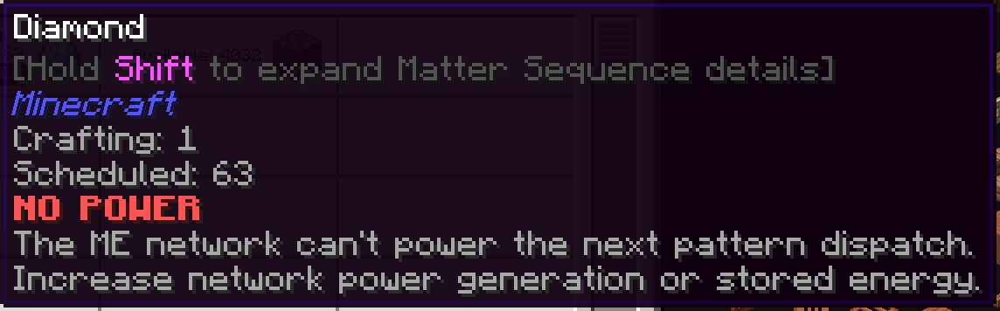

When no enabled provider side has a compatible destination, the scheduled row
shows NO TARGET:

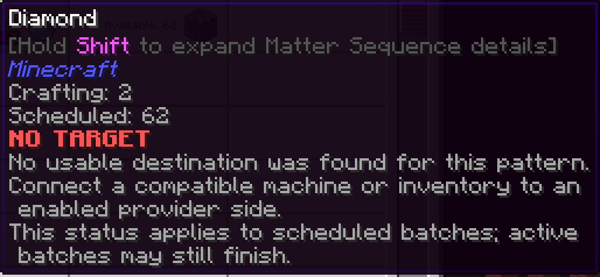

When the destination exists but refuses this pattern's inputs, the row shows
INPUT BLOCKED:

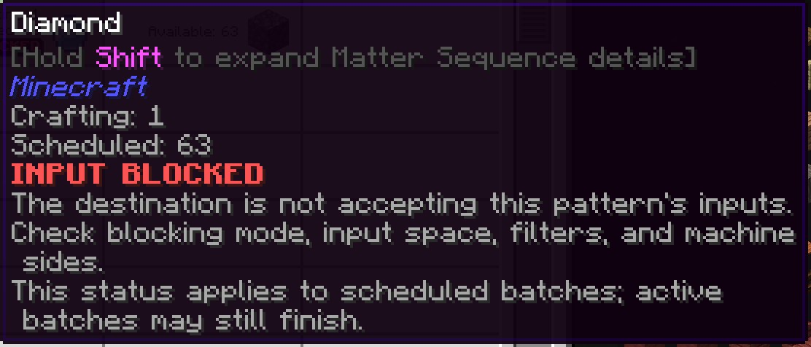

When an active Pattern Provider crafting lock prevents dispatch, the row shows
LOCKED:

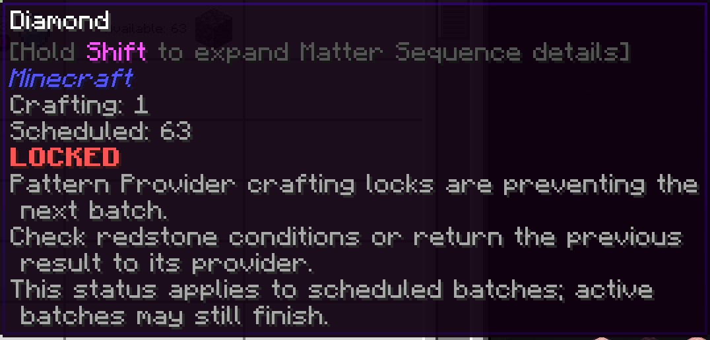

## Timing details

The first sample is marked as low confidence:

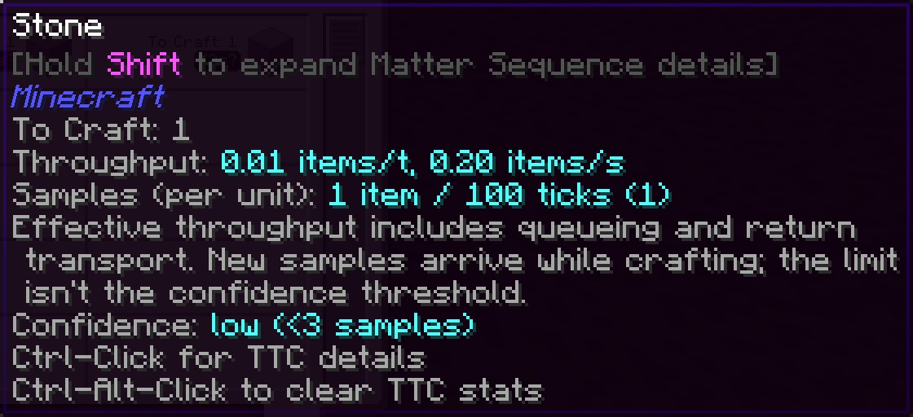

The sample-history tooltip also shows throughput:

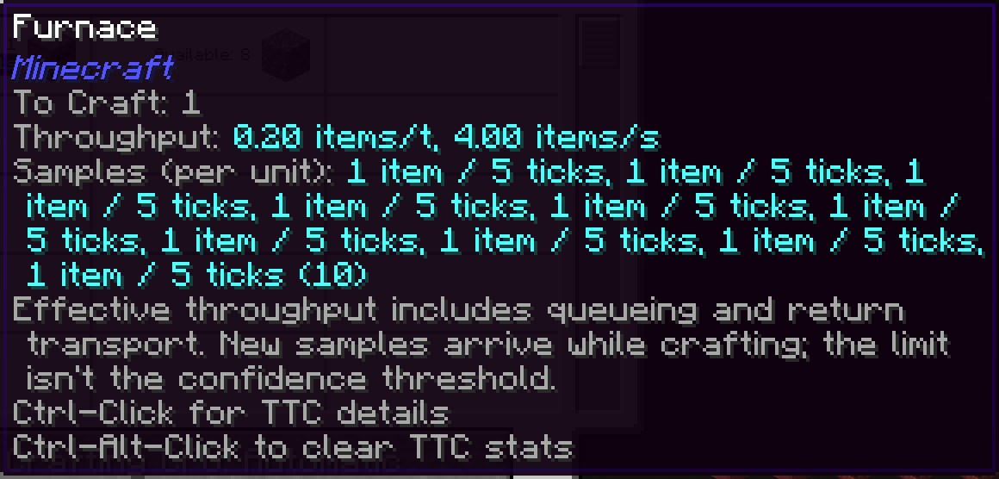

Ctrl-click expands timing details in chat. Ctrl-Alt-click clears that item's
history and confirms the reset:

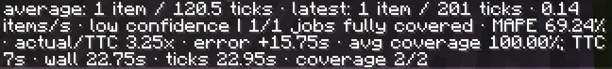

A completed job with partial timing coverage appears in chat as one tracked job
with no fully covered plan yet:

After a fully covered job completes, chat shows one of one jobs fully covered,
prediction error, and the actual-to-estimated duration ratio:

## Sorting

The sort button cycles through these three modes:

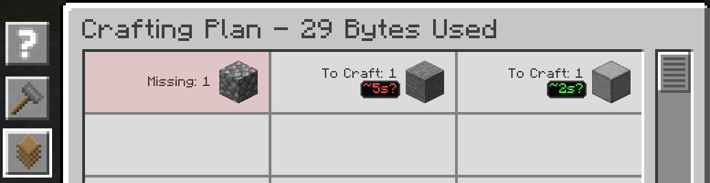

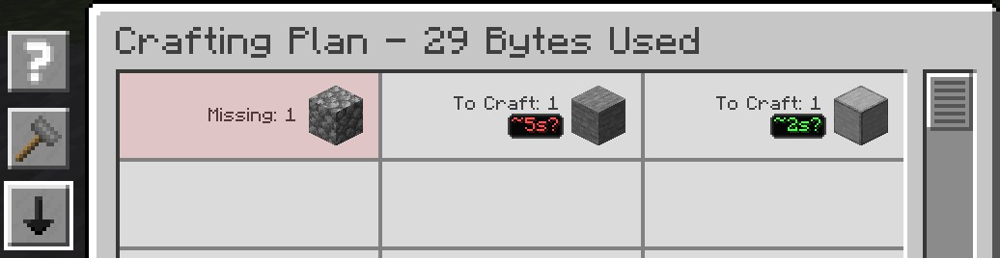

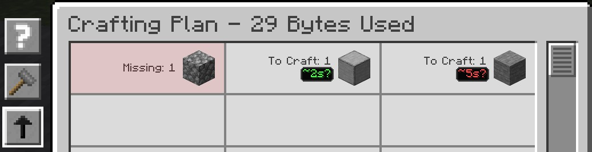

## Other windows

The crafting tree has its own estimate and tooltip:

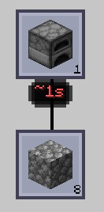

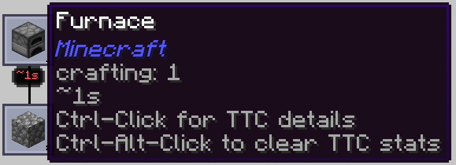

ME Requester with a diamond request and TTC below the amount fields:

## Capture notes

The source images are unmodified PNG evidence from the exact pack. The initial
36-case smoke run passed its semantic checks; all 87 screenshots were manually
reviewed. Automatic visual comparison still requires reference images, so this
is not a claim of a golden-image pass. Source paths, hashes and crop rectangles
are recorded in [sources.json](sources.json).

The standard stone and smooth-stone examples use two real furnaces in a marked,
disposable fixture world. Seeded timing samples make UI states repeatable; they
are demonstrations, not performance measurements. The lifecycle accuracy
examples use actual submitted and completed jobs.

The furnace-item, crafting-tree, sorting, and ME Requester examples also use
seeded history. ME Requester shows a diamond request. Storage, energy and
provider-dispatch examples exercise their named failure and recovery conditions.
Crops retain the complete relevant tooltip, including this pack's additional
item text. The unrelated AE2 title-timer defect is tracked in
[issue 350](https://github.com/cTux/ae2-crafting-time/issues/350).

To refresh these images, use the repository's
[refresh-guide-images skill](../../.codex/skills/refresh-guide-images/SKILL.md)
and `scripts/export-guide-image.ps1`. Keep raw evidence in the smoke archive;
export gallery crops at native size and book copies at
`min(1600, cropWidth * 4)` pixels wide. Inspect the actual book at 1920x1080
before accepting a refresh. See the
[GuideME sizing notes](../guideme-guide/technical-design.md#screenshot-exports).

The five no-data, partial-plan, and chat contexts were captured in the focused
`20260908T120437Z-gallery-02` lifecycle run on the same pack (12 checks passed,
13 raw captures). Per-image run and commit fields in `sources.json` override
the initial run fields. Chat crops omit the account-name line and retain the
throughput and job-coverage details without altering the captured text.

The 24 gallery JPEGs total 1,191,066 bytes (previous PNGs: 1,270,916 bytes).
The 44 enlarged book JPEGs total 4,269,248 bytes (previous small PNGs:
2,535,204 bytes). Book readability increases the total despite JPEG compression;
book exports use quality 75 and gallery exports use quality 90.
