# Screenshot gallery

These are real Minecraft 1.20.1 Forge screenshots, captured at native pixel size.
Each image focuses on a window, recipe row, or tooltip. There are no full-screen
captures or duplicate light/dark versions.

## Crafting plan

Before any timing history exists:

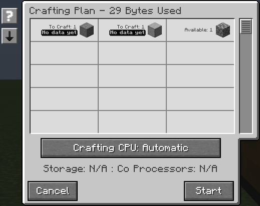

After a completed craft has supplied timing samples:

When only part of the plan has history, the total covers the known work:

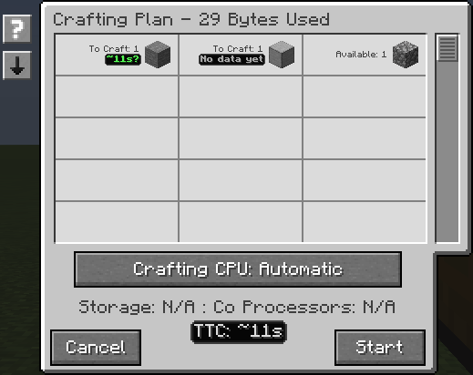

## Live crafting status

Active recipes, scheduled work, and the remaining-time estimate:

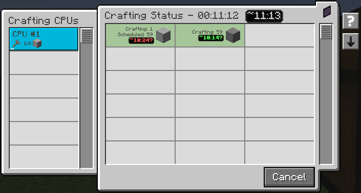

A recipe that has not dispatched yet waits behind a stalled ingredient:

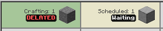

The delayed state after a processing machine stops producing output:

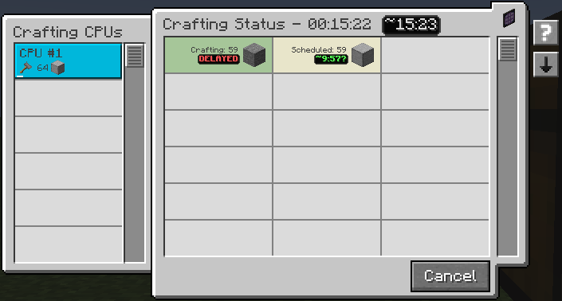

Hovering the delayed recipe shows its timing, recent activity, and advice:

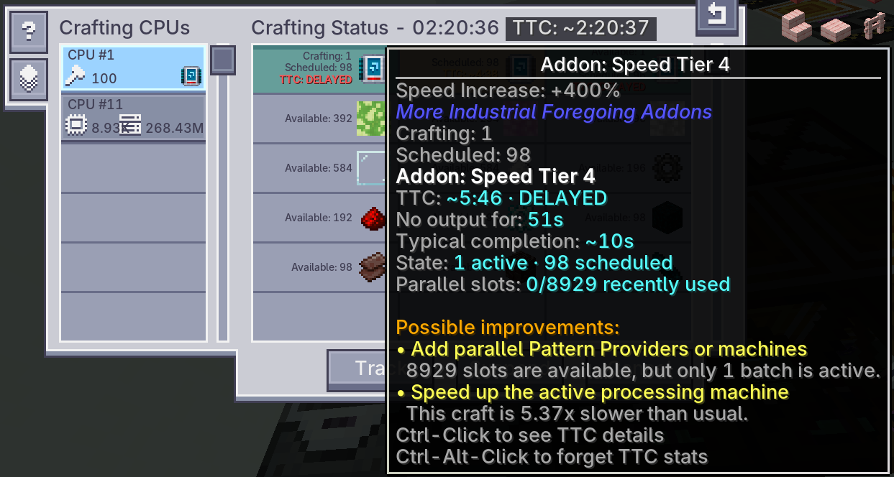

When the CPU can't return its stored items to the ME network, the row explains
the problem and suggests freeing or adding storage:

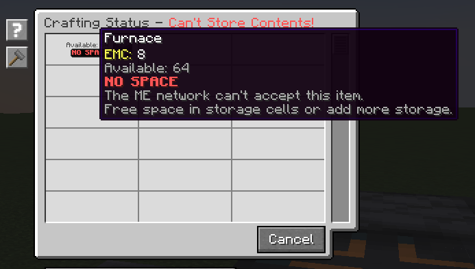

When scheduled work loses its connected Pattern Provider or encoded pattern,
the row shows NO PROVIDER and explains how to resume the job:

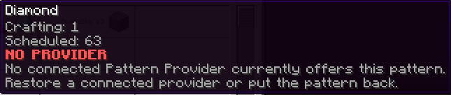

## Timing details

The first sample is marked as low confidence:

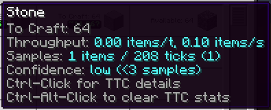

The sample-history tooltip also shows throughput:

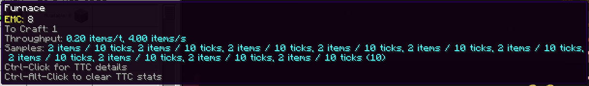

Ctrl-click expands timing details in chat. Ctrl-Alt-click clears that item's
history and confirms the reset:

A completed job with only partial timing coverage is reported separately:

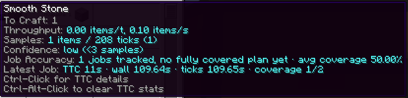

After a fully covered job completes, the tooltip includes prediction error and
the actual-to-estimated duration ratio:

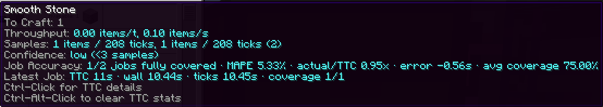

## Sorting

The sort button cycles through these three modes:

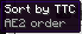

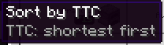

## Other windows

The crafting tree has its own estimate and tooltip:

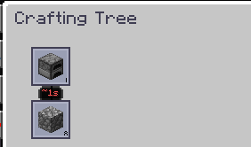

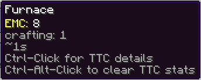

ME Requester with a diamond request and TTC below the amount fields:

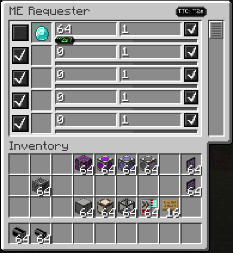

## Capture notes

The stone and smooth-stone examples use two real furnaces in a disposable test
world. Removing fuel produces the delayed state; restoring it lets the job
finish. The partial-accuracy example includes that deliberate pause, so its
long duration is not a normal smelting benchmark.

The furnace-item, crafting-tree, sorting, and ME Requester examples use the
repository's UI test fixtures. Their seeded sample values demonstrate the UI;
they are not machine-performance measurements. ME Requester uses a diamond
request with a seeded two-second estimate.

The NO SPACE example uses a full item cell and seeded retained CPU contents.
Adding writable storage clears the warning without reopening the screen.

The NO PROVIDER example uses a real processing job with one active output and
63 scheduled outputs. Removing its encoded pattern triggers the warning;
restoring it clears the warning in the same open screen. The crop shows the
tooltip at its original pixel size.

To refresh a crop, open the target UI and run `scripts/capture-ui-region.ps1`
inside the same interactive Windows session. Supply the output PNG path and
the region's physical-pixel `X`, `Y`, `Width`, and `Height`. Inspect the saved
image before keeping it; live labels can change between inspection and capture.
