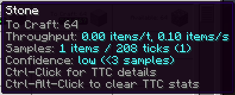

---
navigation:
  title: Достовірність
  parent: index.md
  position: 2
---

# Достовірність

Кожне завершене виробниче вікно — це один зразок. Нові придатні зразки мають
більшу вагу. Оцінка стає надійною після щонайменше трьох зразків, якщо жоден не
відкинуто. До цього TTC лишається видимим зі знаком `?`, який попереджає про
малу історію.

Починаючи з п'яти зразків, надто швидкі або повільні значення можуть бути
відкинуті відносно медіани. Типова межа — у чотири рази. Наприклад, один запуск
із призупиненою машиною не мусить псувати всі наступні оцінки. Підказка показує
кількість збережених і використаних зразків. Замалий ліміт зразків може не дати
оцінці стати надійною.

*Перший тестовий зразок уже корисний, але знак питання попереджає про низьку достовірність.*

[Назад: Навчання швидкості](learning-throughput.md) | [Можливості](index.md) |
[Далі: Точність завдання](job-accuracy.md) | [Налаштування](configuration.md)
