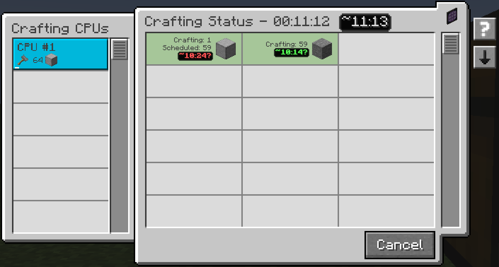

---
navigation:
  title: Призупинення крафту
  parent: features/index.md
  position: 9
---

# Призупинення крафту

У Minecraft 1.20.1 Forge відкрийте стандартний процесор крафту AE2 або
виберіть його на екрані стану крафту в терміналі. Натисніть **Пауза** поруч
зі **Скасувати**, щоб завдання перестало надсилати нові шаблони. Кнопка
**Відновити** продовжить те саме завдання. Його можна скасувати й під час паузи.

Машини завершують уже отриману роботу, а виходи повертаються до процесора.
Вони можуть навіть завершити завдання під час паузи. Зарезервовані інгредієнти
та виконана робота зберігаються. Пауза великого завдання може дати меншим
завданням на інших процесорах доступ до спільних провайдерів після звільнення
машин. Вона не звільняє машину миттєво й не звільняє процесор.

Сервер зберігає паузу після перезапуску світу. Для такого завдання замість
оцінки часу показано **Призупинено**. Навмисна пауза не створює попереджень
про затримку. Після відновлення відлік затримки починається заново.

Перемикач **Дозволити призупинення крафту** в Параметри сервера → Загальні
(`craftingSuspension = true`) увімкнено типово. Якщо його вимкнути, завантажені
процесори продовжать роботу на наступному такті; незавантажені — після
завантаження. Перемикач працює і без профілювання. Цю можливість у Forge
підтримують лише стандартні процесори AE2; замінені аддонами процесори
працюють як раніше.

*Під час виконання видно оцінку часу; для призупиненого завдання натомість показано «Призупинено».*

[Назад: Налаштування](configuration.md) | [Можливості](index.md) |
[Далі: AE2: Crafting Tree](crafting-tree.md)
