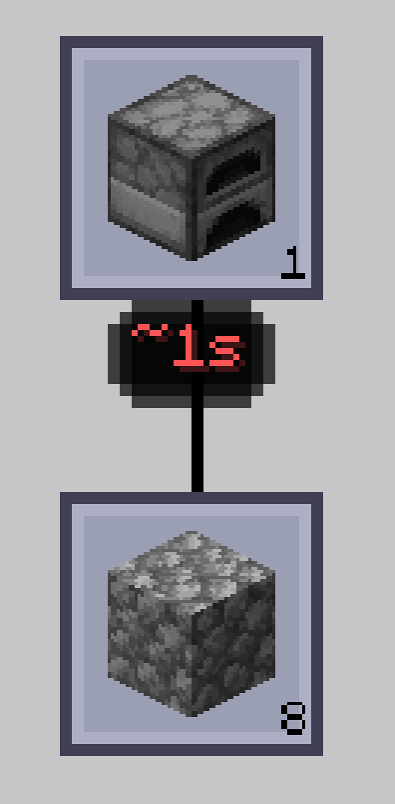

---
navigation:
  title: "AE2: Crafting Tree"
  parent: features/index.md
  position: 9
---

# AE2: Crafting Tree

Якщо AE2: Crafting Tree встановлено на Minecraft 1.20.1 або 1.21.1, вузли
рецептів можуть показувати рекурсивний відомий TTC під предметом. Наведіть
курсор для часу й керування; Ctrl-клік та Ctrl+Alt-клік працюють так само, як у
плані AE2. Кольори порівнюють тривалість видимих вузлів.

Оцінка вузла включає відомі залежності. Наприклад, процесор може врахувати і
друковану схему, і фінальне складання, якщо для обох є історія. Невідомі
залежності роблять результат частковим, а не вигаданим. Інтеграції немає у
версії 26.1.2; без Crafting Tree вона нічого не змінює. `showInTree = false`
також ховає позначки та взаємодію.

*Тестові зразки демонструють оцінку під вузлом Crafting Tree.*

[Назад: Налаштування](configuration.md) | [Можливості](index.md) |
[Далі: ME Requester](me-requester.md) | [Подробиці та скидання](details-and-reset.md)
