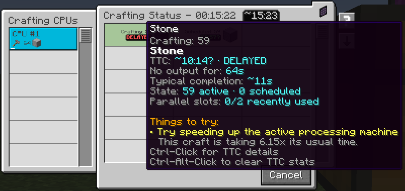

---
navigation:
  title: Діагностика затримок
  parent: index.md
  position: 4
---

# Діагностика затримок

Стан крафту замінює TTC червоним **DELAYED**, лише коли для очікуваної роботи є
історія, а результат не надходив довше за фіксовану межу простою та принаймні
вдвічі довше за звичне виробниче вікно. Будь-який частковий результат перезапускає
таймер.

Наведіть курсор, щоб побачити оцінку, час без поступу, активну й заплановану
кількість та недавнє використання паралельних слотів. Вільні слоти можуть
підказати додати Pattern Provider або машину, зайняті — Crafting Co-Processor.
Клікабельна підказка провайдера підсвічує відповідний блок. Попередження показує,
де зупинилася робота, але не доводить, що машина зламана.

*Піч без палива навмисно демонструє затриманий рядок і підказки вузького місця.*

[Назад: Точність завдання](job-accuracy.md) | [Можливості](index.md) |
[Далі: Сортування та кольори](sorting-and-colors.md) | [Стани](../statuses/index.md)
