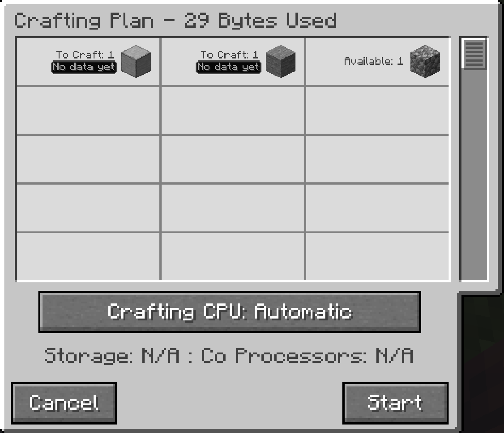

---
navigation:
  title: Посібник
  parent: features/index.md
  position: 12
---

# Посібник

Створіть цей посібник із книжки, незарядженого кристала Certus Quartz і
годинника в будь-якому порядку. Візьміть його в руку й використайте, щоб
відкрити сторінки. Увесь вміст запаковано з модом, тому для читання й пошуку
інтернет не потрібен.

Користуйтеся кнопками головної сторінки та історії, деревом змісту й пошуком.
У перемикачі мови можна вибрати повне українське дерево. Наприклад, знайдіть
`Достовірність`, щоб зрозуміти знак питання біля TTC. Forge 1.20.1 потребує
необов'язковий GuideME, Fabric 1.20.1 використовує вбудований переглядач AE2,
а сучасний NeoForge — GuideME. Без необов'язкового переглядача решта мода
працює, а зламаний рецепт не з'являється.

У Fabric 1.20.1 новий посібник є звичайною книжкою з позначкою мода. Завдяки
цьому гравці без Crafting Time можуть приєднатися до сервера з модом. Перед
оновленням зі старішої версії Fabric створіть резервну копію світу й даних
гравців. Збережені предмети `ae2craftingtime:guide` можуть зникнути під час
завантаження інвентарів після вилучення старого ID. Після оновлення створіть
новий посібник.

*Цей справжній ігровий екран показує приклад без історії, на який посилається розділ 1.*

[Назад: Підтримка аддонів](addon-support.md) | [Можливості](index.md) |
[Вступ](../index.md) | [Розділ 1](../getting-started.md)
