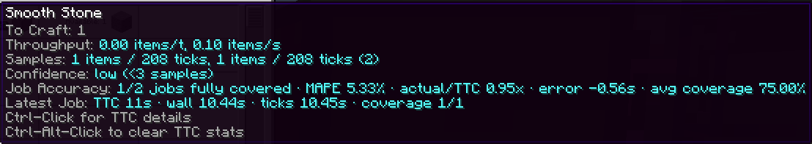

---
navigation:
  title: Точність завдання
  parent: index.md
  position: 3
---

# Точність завдання

Коли AE2 приймає завдання, мод фіксує прогноз усього плану. Після успішного
завершення він порівнює TTC із фактичним часом і номінальним часом ігрових
тіків. Покриття показує, для скількох створюваних рядків була оцінка.

У подробицях є кількість повністю покритих завдань, середня абсолютна відсоткова
похибка (MAPE) та співвідношення фактичного часу до TTC. Значення близько `1.0x`
означає влучний прогноз, `1.5x` — приблизно на половину довше. Часткові плани
показують покриття, але не змінюють загальну похибку. Скасовані, відновлені або
неоцінені завдання не враховуються. Ці дані не змінюють навчену швидкість.

*Тестові значення показують повне покриття, похибку й співвідношення фактичного часу до TTC.*

[Назад: Достовірність](confidence.md) | [Можливості](index.md) |
[Далі: Діагностика затримок](delay-diagnostics.md) | [Подробиці та скидання](details-and-reset.md)
