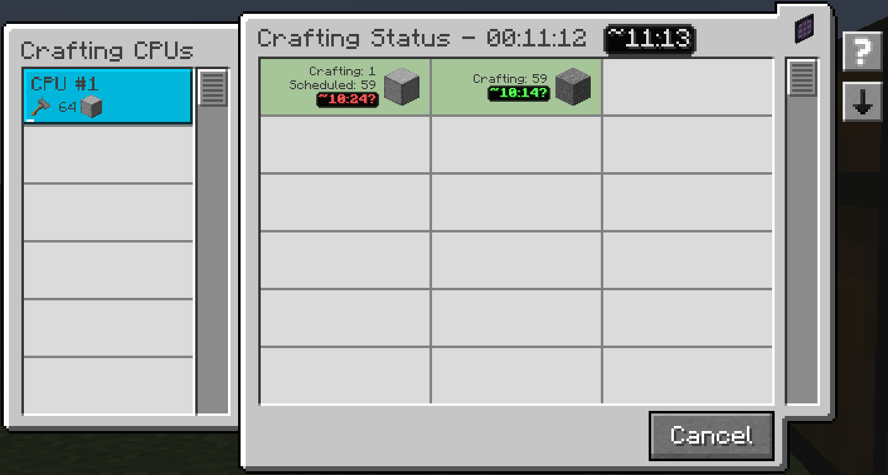

---
navigation:
  title: Навчання швидкості
  parent: features/index.md
  position: 1
---

# Навчання швидкості

Мод навчається на результатах, які ваша мережа AE2 справді приймає. Він вимірює
виробниче вікно результату й зберігає останні завершені вікна саме цієї мережі.
Паралельні партії об'єднуються, тому дві машини навчають реальної сумарної
швидкості, а не суми двох тривалостей.

Наприклад, 64 процесори за вісім секунд дають близько восьми процесорів за
секунду. Інша ME-мережа має окрему історію. Предмети рахуються в штуках, рідини
й підтримувані хімікати — у мілівідрах. Новий результат може показувати **No
data yet**, доки не завершиться придатне вікно. Заміна машин вплине лише на
наступні зразки.

*Результати активного завдання стають історією після завершення виробничого вікна.*

[Назад: Оцінки часу](time-estimates.md) | [Можливості](index.md) |
[Далі: Достовірність](confidence.md) | [Збережена історія](saved-history.md)
