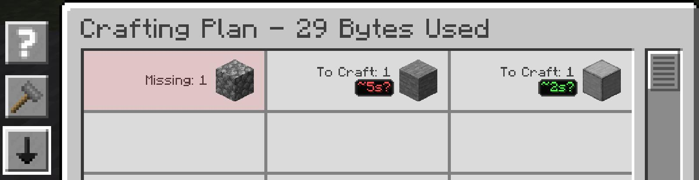

---
navigation:
  title: Сортування та кольори
  parent: features/index.md
  position: 5
---

# Сортування та кольори

План і стан крафту відкриваються в режимі **TTC: longest first**, щоб найдовша
відома робота була зверху. Кнопка на панелі перемикає порядок AE2, від
найкоротшого й від найдовшого. Вибір діє лише доки екран відкритий. Рядки без
оцінки лишаються після відомих зі своїм початковим взаємним порядком.

Відомі TTC забарвлюються від зеленого через жовтий до червоного відносно інших
видимих значень. У списку 2, 10 і 30 секунд перший рядок буде швидким краєм, а
останній — повільним. Червоний тут не обов'язково означає затримку; справжня
затримка має окрему червону позначку **DELAYED**.

*Тестові значення показують порядок від найдовшого та відносні кольори швидкості.*

[Назад: Діагностика затримок](delay-diagnostics.md) | [Можливості](index.md) |
[Далі: Подробиці та скидання](details-and-reset.md) | [Оцінки часу](time-estimates.md)
