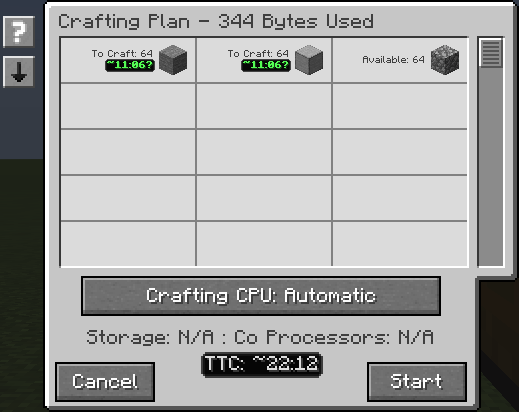

---
navigation:
  title: Оцінки часу
  parent: index.md
  position: 0
---

# Оцінки часу

У плані крафту TTC показано біля кожного рядка, для якого є вивчені дані.
Час рядка стосується всієї кількості **To Craft**, а не одного запуску шаблону.
Підсумок під даними CPU додає відомі рядки; якщо для частини рядків немає
даних, це лише відома частина завдання.

У стані крафту використовуються ті самі оцінки. Загальний час іде найдовшим
шляхом залежностей, тому паралельні гілки не додаються. Наприклад, дві незалежні
гілки по 10 секунд можуть завершитися приблизно за 10 секунд, а два послідовні
етапи — за 20. Це не точний термін: швидкість машин, інші завдання й навантаження
сервера можуть змінити результат.

*Тестові значення показують дві вивчені оцінки рецептів та їхній відомий підсумок.*

[Можливості](index.md) | [Далі: Навчання швидкості](learning-throughput.md) |
[Перша оцінка](../getting-started.md)
