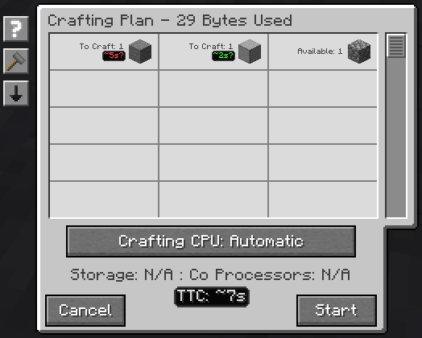

---
navigation:
  title: Оцінки часу
  parent: features/index.md
  position: 0
---

# Оцінки часу

Коли ввімкнено **Показувати символи**, кожне показане значення часу починається
з ⏱. Він є в рядках, підсумках, картках CPU, підказках, вибірках,
тривалості затримок, точності, чаті та підтримуваних доповненнях. Позначки
приблизності й невизначеності лишаються: `~12с?` стає `⏱ ~12с?`. Швидкості й
кількості лишаються без символу. Вигляд символу залежить від доступного шрифту,
масштабу й ресурс-паків. У рядках плану й стану крафту символи мають той самий
колір, що й текст. Підсумковий TTC у плані має колір рядка з даними CPU.
В інших вікнах символи зберігають свої кольори.

У плані крафту TTC показано біля кожного рядка, для якого є вивчені дані.
Час рядка стосується всієї кількості **To Craft**, а не одного запуску шаблону.
Підсумок під даними CPU додає відомі рядки; якщо для частини рядків немає
даних, це лише відома частина завдання.

Якщо ввімкнути **Стислі кількості виготовлення**, план показує доступну кількість
і кількість до виготовлення в одному
рядку: `4/10`. Якщо є лише одна кількість, `A4` означає доступну, а `C10` —
кількість до виготовлення. Попередження про нестачу й циклічний рецепт
залишаються окремо. Наведи курсор, щоб побачити повні кількості з підписами AE2.

У стані крафту використовуються ті самі оцінки. Загальний час іде найдовшим
шляхом залежностей, тому паралельні гілки не додаються. Наприклад, дві незалежні
гілки по 10 секунд можуть завершитися приблизно за 10 секунд, а два послідовні
етапи — за 20. Це не точний термін: швидкість машин, інші завдання й навантаження
сервера можуть змінити результат.
Коли загальний TTC відомий, заголовок показує `Час: ⏱ ...` звичайним кольором
замість часу AE2. Якщо оцінки немає, заголовок показує звичайну назву CPU.
Червоне попередження про сховище лишається. Вимкніть **Загальний час стану**,
щоб повернути заголовок AE2.

З тим самим налаштуванням стан крафту показує доступну, виготовлювану й
заплановану кількості в
одному рядку, саме в такому порядку: `4/10/200`. Відсутня кількість позначена
`-`; якщо є лише одна, її позначає префікс `A`, `C` або `S`. Наведи курсор,
щоб побачити повні кількості з підписами AE2. **Стислі кількості
виготовлення** за замовчуванням вимкнено в **Налаштування > Клієнт >
Відображення**. Увімкни його, щоб показати стислий рядок в обох вікнах.
Це налаштування не залежить від TTC у рядках.

*Тестові значення показують дві вивчені оцінки рецептів та їхній відомий підсумок.*

[Можливості](index.md) | [Далі: Навчання швидкості](learning-throughput.md) |
[Перша оцінка](../getting-started.md)
