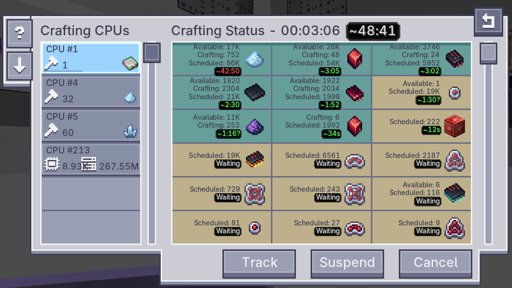

---
navigation:
  title: ЗАТРИМКА
  parent: statuses/index.md
  position: 7
---

# ЗАТРИМКА

**Позначка:** `ЗАТРИМКА`

Цей стан з'являється для активного рядка, коли виробництво стоїть одночасно 30
секунд і довше ніж удвічі за вивчений середній інтервал виробництва. Блокувальні
позначки запланованої роботи стосуються запланованих партій.

## Що перевірити

1. Наведіть на рядок, щоб побачити недавню активність і місткість.
2. Перевірте активну машину, вихід, паливо й потрібні складники.
3. Відновіть виробництво або скасуйте завдання, яке не може продовжитися.

Будь-який прийнятий результат перезапускає таймер і очищує позначку. Завершення,
скасування, скидання результату або перезавантаження також очищує тимчасовий
стан. Поріг потребує історії й не доводить, яка саме машина спричинила затримку.

*Рецепт обробки перевищив обидві частини вивченого порогу затримки.*

[Назад: Очікування](waiting.md) | [Стани](index.md) |
[Далі: Даних ще немає](no-data-yet.md) | [Діагностика затримок](../features/delay-diagnostics.md)
