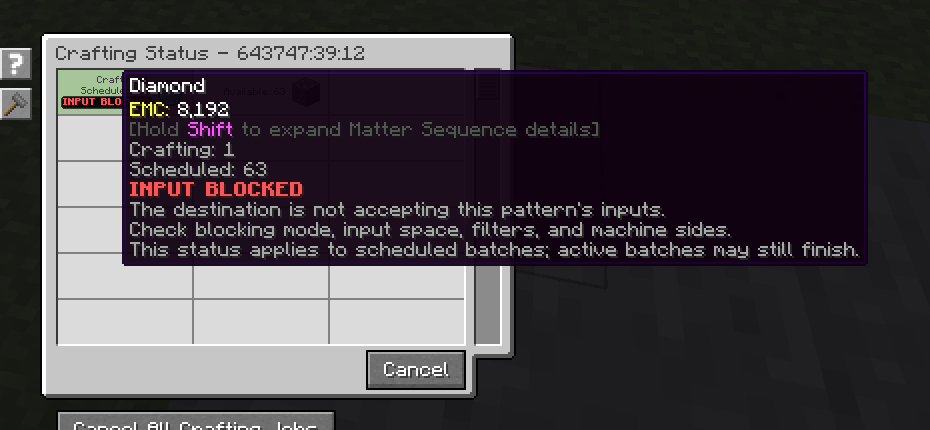

---
navigation:
  title: Вхід заблоковано
  parent: statuses/index.md
  position: 4
---

# Вхід заблоковано

**Позначка:** `Вхід заблоковано`

Цей стан з'являється для запланованого рядка, коли приймач існує, але режим
блокування або помічена відмова вставлення зупиняє відправлення. Причини з вищим
пріоритетом показуються першими. Активні партії можуть завершитися.

## Що перевірити

1. Перевірте режим блокування провайдера шаблонів.
2. Звільніть місце для входу в приймачі.
3. Перевірте фільтри, дозволені сторони й правила входу машини.

Успішна, невідома або змінена перевірка очищує стан; інакше він зникає через 20
серверних тіків і оновлення. Часткове прийняття з подальшим успішним відправленням
не є заблокованим входом. Позначка не називає слот, сторону чи фільтр.

*Приймач існує, але не приймає складники цього шаблону.*

[Назад: Заблоковано](locked.md) | [Стани](index.md) |
[Далі: Немає приймача](no-target.md) | [Діагностика затримок](../features/delay-diagnostics.md)
