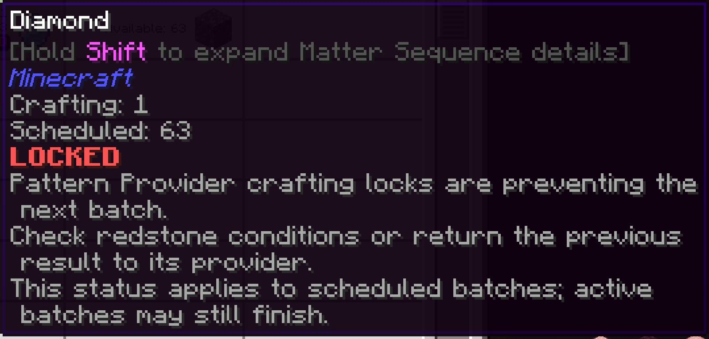

---
navigation:
  title: Заблоковано
  parent: statuses/index.md
  position: 3
---

# Заблоковано

**Позначка:** `Заблоковано`

Цей стан з'являється для запланованого рядка, коли спробу відправлення зупиняє
активне блокування провайдера шаблонів. Проблеми провайдера й живлення мають
вищий пріоритет. Активні партії рядка можуть завершитися.

## Що перевірити

1. Перевірте редстоун і режим блокування провайдера.
2. Виконайте або вимкніть активну умову редстоуну.
3. Поверніть попередній результат до провайдера, якщо цього вимагає режим.

Наступна успішна, невідома або змінена перевірка очищує стан; інакше він зникає
через 20 серверних тіків і оновлення. Самого налаштування блокування недостатньо:
мод має побачити, що воно зупинило відправлення. Стан не зберігається у світі.

*Активне блокування провайдера зупиняє наступну заплановану партію.*

[Назад: Немає енергії](no-power.md) | [Стани](index.md) |
[Далі: Вхід заблоковано](input-blocked.md) | [Діагностика затримок](../features/delay-diagnostics.md)
