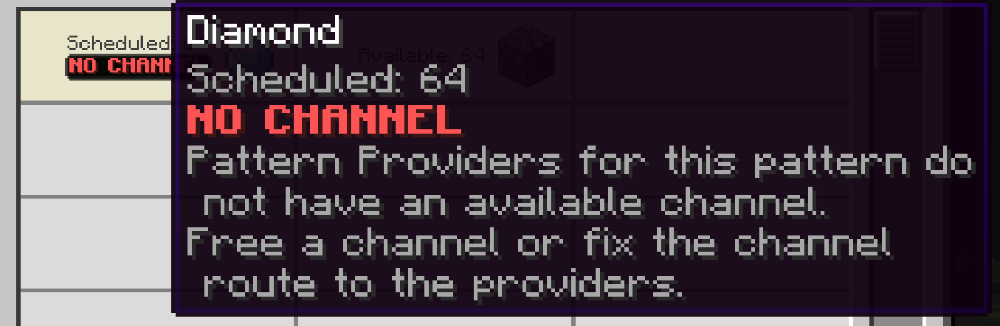

---
navigation:
  title: Немає каналу
  parent: statuses/index.md
  position: 3
---

# Немає каналу

**Позначка:** `Немає каналу`

Цей стан з'являється, коли запланована робота доходить до всіх постачальників
точного шаблону, але кожен живлений і завантажений постачальник не має доступного
каналу. До реальної спроби відправлення рядок показує `Очікування`. Порожній
пошук постачальників дає `Без провайдера`, а брак енергії для відправлення —
`Немає енергії`.

## Що перевірити

1. Звільніть канал у кабельній гілці постачальника.
2. Виправте кабельний маршрут між постачальником і контролером.
3. Зачекайте, доки мережа ME завершить завантаження після зміни маршруту.

Успішна або непевна повторна спроба очищує стан одразу; інакше він старіє
20 серверних тіків. Коли постачальник отримує канал, відкритий екран стану
крафту відновлюється, а завдання може продовжитися.

*Шаблон відомий, але його постачальники не можуть приєднатися до мережі каналів.*

[Назад: Немає енергії](no-power.md) | [Стани](index.md) |
[Далі: Заблоковано](locked.md) | [Діагностика затримок](../features/delay-diagnostics.md)
