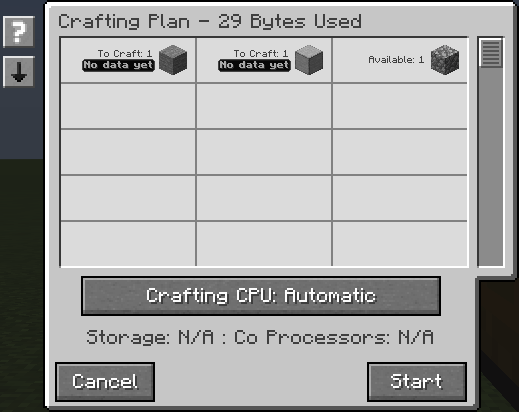

---
navigation:
  title: Даних ще немає
  parent: statuses/index.md
  position: 8
---

# Даних ще немає

**Позначка:** `Даних ще немає`

Цей стан з'являється в плані або стані крафту, коли сервер не має придатного
збереженого вимірювання часу для цього результату. Блокування й активна затримка
мають вищий пріоритет там, де вони застосовуються.

## Що перевірити

1. Завершіть типовий крафт з увімкненим профілюванням.
2. Дайте рецепту нормально створити результат для вимірювання швидкості.
3. Перевірте, чи історію не очищено, не втрачено або відокремлено іншою мережею.

Позначка зникає після завершеного інтервалу виробництва з придатною історією.
Вимірювання належать серверу й світу, мають обмежений строк зберігання та ключ
мережі ME і результату. Перше вимірювання все одно має низьку впевненість.

*Для цих рядків плану ще немає збережених вимірювань часу.*

[Назад: ЗАТРИМКА](delayed.md) | [Стани](index.md) |
[Далі: Оцінка TTC](estimated.md) | [Навчання швидкості](../features/learning-throughput.md)
