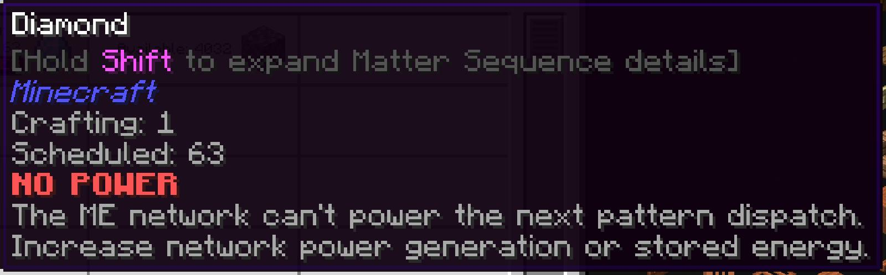

---
navigation:
  title: Немає енергії
  parent: statuses/index.md
  position: 2
---

# Немає енергії

**Позначка:** `Немає енергії`

Цей стан з'являється для запланованого рядка, коли мережа ME не може витратити
достатньо енергії на наступне реальне відправлення шаблону. `Без провайдера` має
вищий пріоритет. Активні партії поза мережею можуть продовжити роботу.

## Що перевірити

1. Збільште вироблення енергії мережі ME.
2. Додайте або зарядіть мережеве сховище енергії.
3. Перевірте живлений шлях між CPU, провайдером і мережею.

Успішна перевірка живлення очищує стан одразу; інакше він старіє 20 серверних
тіків і зникає після наступного оновлення. Через лаг сервера це може тривати
довше за одну секунду. Незаживлена зовнішня машина сама по собі цього не доводить.

*Мережа має заплановану роботу, але не може оплатити наступне відправлення.*

[Назад: Без провайдера](no-provider.md) | [Стани](index.md) |
[Далі: Заблоковано](locked.md) | [Діагностика затримок](../features/delay-diagnostics.md)
