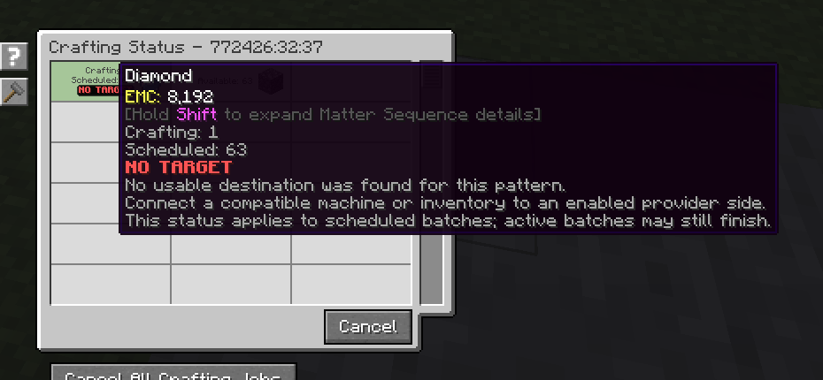

---
navigation:
  title: Немає приймача
  parent: statuses/index.md
  position: 5
---

# Немає приймача

**Позначка:** `Немає приймача`

Цей стан з'являється для запланованого рядка, коли спроба обробки не знаходить
придатного приймача на жодній дозволеній стороні провайдера. Усі блокувальні
причини з вищим пріоритетом показуються першими. Активні партії можуть завершитися.

## Що перевірити

1. Під'єднайте сумісну машину або інвентар.
2. Розташуйте його біля дозволеної сторони провайдера шаблонів.
3. Перевірте сумісність шаблону й типу приймача.

Успішна, невідома або змінена перевірка очищує стан; інакше він зникає через 20
серверних тіків і оновлення. Приймач, який існує, але відхиляє складники, не є
`Немає приймача`. Зайняті чи неперевірені альтернативи також цього не доводять.

*Для наступної запланованої партії не знайдено сумісного приймача.*

[Назад: Вхід заблоковано](input-blocked.md) | [Стани](index.md) |
[Далі: Очікування](waiting.md) | [Діагностика затримок](../features/delay-diagnostics.md)
