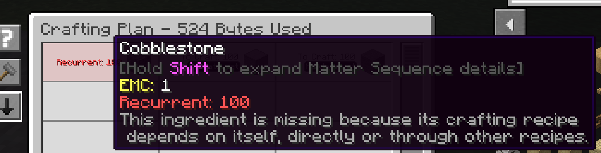

---
navigation:
  title: Циклічне
  parent: statuses/index.md
  position: 11
---

# Циклічне

**Позначка:** `Циклічне: 1`

Позначка «Циклічне» з'являється в плані крафту до запуску завдання. Червоний
текст звичайної товщини означає, що AE2 довела: рецепт відсутнього інгредієнта
неможливо використати, бо він зрештою потребує того самого інгредієнта. Наприклад,
A може потребувати B, а B — A. Пряма самозалежність і довші цикли працюють так само.

Число — це загальна кількість, якої бракує в цьому рядку за даними AE2. Якщо
рядок поєднує звичайну й циклічну нестачу, він усе одно показує загальну кількість,
а не лише циклічну частину. Звичайна нестача лишається «Відсутнє». Одного
відхиленого циклічного варіанта недостатньо, якщо AE2 може використати інший рецепт.

## Що перевірити

1. Перевірте проблемний інгредієнт і наведіть на нього, щоб прочитати пояснення.
2. Простежте його шаблони, доки не знайдете цикл.
3. Додайте придатний початковий запас або виберіть чи виправте рецепт, який розриває цикл.
4. Розрахуйте план ще раз.

Новий розрахунок замінює діагноз; старий план не переносить його в інше меню чи
мережу. Успішний план із придатним початковим запасом або альтернативою не має
рядка «Циклічне», але наявність потрібного результату в сховищі не гарантує, що
AE2 використає його як початковий запас. Мод пояснює цикл, але не виправляє його.
Вимірювання часу, кольори TTC і порядок виконуваного завдання не керують цією
позначкою. Crafting Tree та ME Requester мають окремі екрани.

*У прикладі A -> B -> A AE2 показує відсутній рядок бруківки як «Циклічне: 100».
Інший предмет циклу не обов'язково стає відсутнім рядком.*

[Назад: Оцінка TTC](estimated.md) | [Стани](index.md) |
[Оцінки часу](../features/time-estimates.md)
