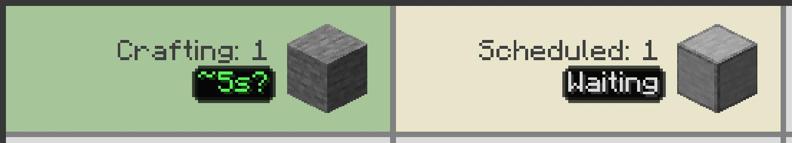

---
navigation:
  title: Очікування
  parent: statuses/index.md
  position: 6
---

# Очікування

**Позначка:** `Очікування`

Цей стан з'являється, коли результат має заплановану роботу, але його перший
шаблон ще не відправлено. Це звичайний запасний стан, якщо мод не бачить точнішої
проблеми з провайдером, живленням, блокуванням, входом або приймачем.

## Що перевірити

1. Перевірте попередні складники й залежності завдання.
2. Перевірте, чи провайдери й машини не зайняті іншою роботою.
3. Дочекайтеся завершення попередньої партії перед зміною мережі.

Позначка зникає після відправлення першої партії, появи точнішої причини або
завершення запланованої роботи. Вона не доводить несправність машини й не має
вивченого порогу часу.

*Результат заплановано після роботи, яка ще не створила потрібний складник.*

[Назад: Немає приймача](no-target.md) | [Стани](index.md) |
[Далі: ЗАТРИМКА](delayed.md) | [Діагностика затримок](../features/delay-diagnostics.md)
