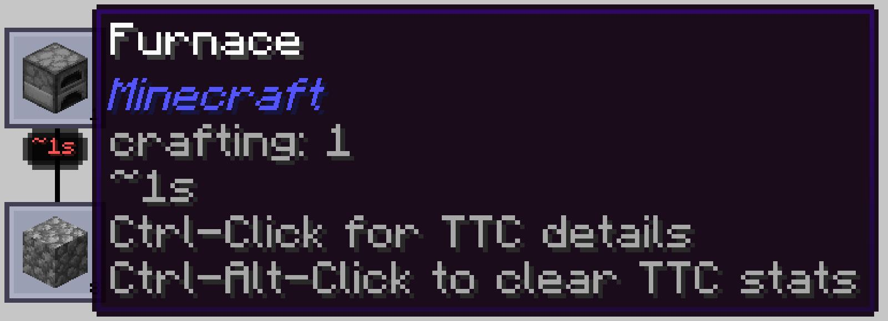

---
navigation:
  title: Addon support
  parent: features/index.md
  position: 11
---

# Addon support

Applied Mekanistics chemical keys use the same normalized millibucket units as
AE2 fluids, so learned rates and TTC stay meaningful. Compatible crafting CPUs
from AdvancedAE, NeoEco, and AE2 Lightning Tech can also contribute normal
profiling events on their supported targets.

For example, a supported addon CPU processing a chemical recipe teaches its
network/output history and later shows TTC through the usual AE2 screens. The
integration does not make an addon required: when one is absent or unsupported,
AE2 Crafting Time skips only that adapter and keeps its core behavior. Addon
screens do not automatically gain badges unless a dedicated UI integration is
listed separately. Installed addon versions may require a restart before the
compatible integration is selected.

*The seeded Crafting Tree tooltip demonstrates an optional addon reading the same server-owned statistics.*

[Previous: ME Requester](me-requester.md) | [Features](index.md) |
[Next: The guide book](guide-book.md) | [AE2: Crafting Tree](crafting-tree.md)
