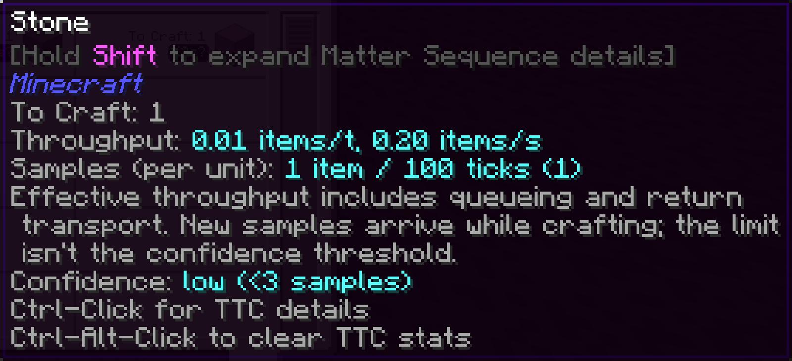

---
navigation:
  title: Confidence
  parent: features/index.md
  position: 2
---

# Confidence

Each completed production window is one sample. Newer usable samples count more
than older ones. An estimate becomes reliable after at least three samples when
none had to be excluded; before that, TTC stays visible with a `?` so you know
the history is thin.

Starting with five samples, unusually fast or slow duration-per-unit values can
be excluded relative to the median. The default boundary is four times above
or below it. For example, one paused machine run among several normal runs may
be ignored instead of making every later estimate look slow. The tooltip shows
retained and used sample counts. A low configured sample limit can prevent an
estimate from ever becoming reliable.

*The seeded first sample remains useful, but the question mark warns that confidence is low.*

[Previous: Learning throughput](learning-throughput.md) | [Features](index.md) |
[Next: Job accuracy](job-accuracy.md) | [Configuration](configuration.md)
