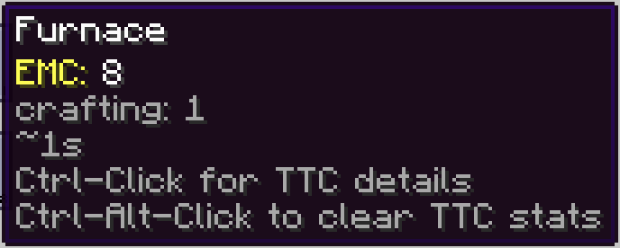

---
navigation:
  title: Configuration
  parent: features/index.md
  position: 8
---

# Configuration

Server settings live in `<world>/serverconfig/ae2craftingtime-server.toml`. Starting
a world creates this file if it's missing. In singleplayer, `<world>` is that
save under `saves`; on a dedicated server, it's the world selected by
`level-name`. If `config/ae2craftingtime-common.toml` contains old server
settings, the new file starts with those valid values and defaults for the rest.
The old file stays in place. Existing world files aren't rewritten on startup.

Client settings live in `config/ae2craftingtime-client.toml`.

In Client → Appearance, **Text shadow** controls shadows on text drawn by AE2
Crafting Time. It's on by default. Turn it off for flatter text; AE2's own text
keeps its original shadow setting. You can also set `textShadow = false` in the
client file.

**Badge background** in the same Client → Appearance section is on by default.
Turn it off to hide the rounded backgrounds behind AE2 Crafting Time's badges
while keeping their text visible. It doesn't hide AE2's own window, row, or
tooltip backgrounds. Your badge color and opacity stay saved, so turning it
back on restores them. You can also set `badgeBackground = false` in the client
file.

- `enabled` turns profiling and server-owned stats on or off.
- `showInTree` controls Crafting Tree badges, tooltips, spacing, and clicks on
  supported pre-26 targets.
- `showChatMessages` controls Ctrl-click details and reset notices. It does not
  block the reset itself.
- `maxSamples` keeps 1–100 recent throughput and runtime accuracy samples per
  output; the default is 10.
- `outlierMultiplier` accepts 1.0–1000.0 and defaults to 4.0.

For example, set `maxSamples = 20` to retain a longer recent history. Restart
the game or server after changing the sample window or outlier boundary because
they are applied when the profiler is created. Invalid fields keep their defaults;
values outside the allowed ranges are rejected.

*The seeded tooltip shows the Crafting Tree display controlled by `showInTree`.*

[Previous: Saved history](saved-history.md) | [Features](index.md) |
[Next: AE2: Crafting Tree](crafting-tree.md) | [Confidence](confidence.md)
