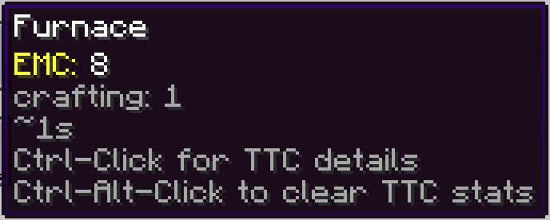

---
navigation:
  title: Configuration
  parent: features/index.md
  position: 8
---

# Configuration

Server settings live in `<world>/serverconfig/ae2craftingtime-server.toml`. Starting
a world creates this file if it's missing. In singleplayer, `<world>` is that
save under `saves`; on a dedicated server, it's the world selected by
`level-name`. If `config/ae2craftingtime-common.toml` contains old server
settings, the new file starts with those valid values and defaults for the rest.
The old file stays in place. Existing world files aren't rewritten on startup.

Client settings live in `config/ae2craftingtime-client.toml`.

**Detect recurrent ingredients** in Server → Diagnostics starts off. Turn it on
to mark proven recipe loops as Recurrent in Crafting Plan, or set
`recurrentDetection = true` in the server file. Existing files that explicitly
enable it keep that choice; Reset returns it to off.

**Show emoji** in Client → Appearance starts on (`showEmoji = true`). It adds
colored symbols to TTC times, statuses, and local chat. Turn it off for text-only
labels and times. Saving with Done updates visible chat too; reset restores On.
Each player controls their own display. Values, colors, badges, and actions stay
the same.

In Client → Appearance, **Text shadow** controls shadows on text drawn by AE2
Crafting Time. It's off by default. Turn it on for shadowed text; AE2's own text
keeps its original shadow setting. You can also set `textShadow = true` in the
client file.

**Badge background** in the same Client → Appearance section is off by default.
Turn it on to show rounded backgrounds behind AE2 Crafting Time's badges
while keeping their text visible. It doesn't hide AE2's own window, row, or
tooltip backgrounds. Your badge color and opacity stay saved, so turning it
on restores them. You can also set `badgeBackground = true` in the client
file.

**Fast-to-slow colors** and **Compact crafting amounts** in Client → Displays
also start off. Turn them on for the TTC color scale or shortened row amounts.
Saved choices stay as you set them.

If **Badge background** and **Fast-to-slow colors** are both off, ordinary time
estimates and compact amounts in Crafting Plan and Crafting Status use the same
text color as AE2's nearby amounts. This follows the current screen colors, even
on tinted rows. Collecting, waiting, delayed, and blocked labels keep their
warning colors, and compact amounts beside them use that warning color too.
Your chosen colors and badge opacity stay saved when you switch either option
off. This row behavior also applies to compact amounts when profiling is off.

- `enabled` turns profiling and server-owned stats on or off.
- `showInTree` controls Crafting Tree badges, tooltips, spacing, and clicks on
  supported pre-26 targets.
- `showChatMessages` controls Ctrl-click details and reset notices. It does not
  block the reset itself.
- `maxSamples` keeps 1–100 recent throughput and runtime accuracy samples per
  output; the default is 10.
- `outlierMultiplier` accepts 1.0–1000.0 and defaults to 4.0.

For example, set `maxSamples = 20` to retain a longer recent history. Restart
the game or server after changing the sample window or outlier boundary because
they are applied when the profiler is created. Invalid fields keep their defaults;
values outside the allowed ranges are rejected.

*The seeded tooltip shows the Crafting Tree display controlled by `showInTree`.*

[Previous: Saved history](saved-history.md) | [Features](index.md) |
[Next: AE2: Crafting Tree](crafting-tree.md) | [Confidence](confidence.md)
