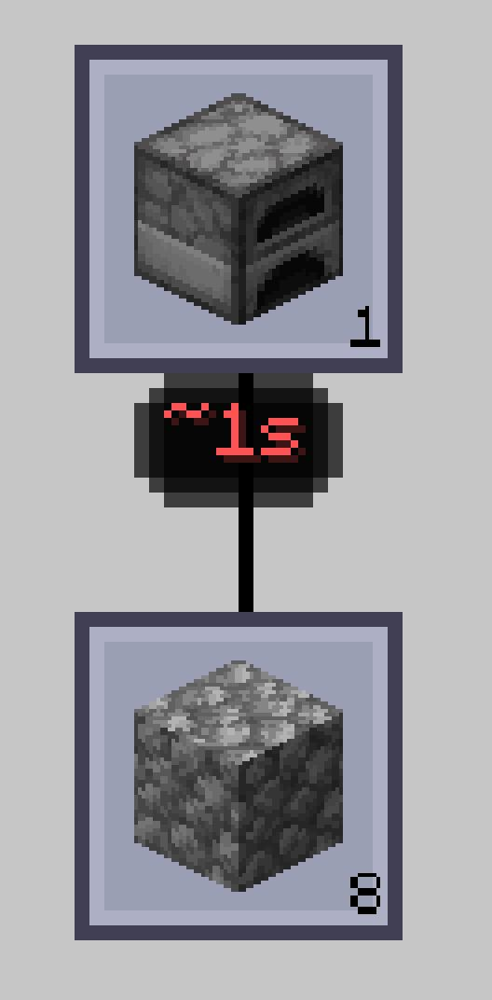

---
navigation:
  title: "AE2: Crafting Tree"
  parent: features/index.md
  position: 9
---

# AE2: Crafting Tree

When AE2: Crafting Tree is installed on Minecraft 1.20.1 or 1.21.1, its recipe
nodes can show recursive known TTC below the item. Hover a node for timing and
details/reset hints; Ctrl-click and Ctrl+Alt-click use the same controls as the
AE2 plan rows. Colors compare visible node durations.

A node's estimate includes its known dependency work. For example, a processor
node can include both the printed circuit and final assembly time when both
have history. Missing dependency data makes the known result partial rather
than inventing a duration. The integration is absent on the 26.1.2 target and
disappears cleanly when Crafting Tree is not installed. `showInTree = false`
also hides its badges and interactions.

*Seeded sample values demonstrate the estimate below a Crafting Tree node.*

[Previous: Configuration](configuration.md) | [Features](index.md) |
[Next: ME Requester](me-requester.md) | [Details and reset](details-and-reset.md)
