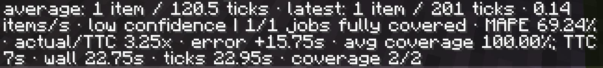

---
navigation:
  title: Details and reset
  parent: features/index.md
  position: 6
---

# Details and reset

Hover a supported row or Crafting Tree node for timing, sample, confidence, and
accuracy details. Hold Ctrl and click it to print a compact report in chat. Hold
Ctrl+Alt and click the same target to clear retained history for that output on
your current AE2 network. The mouse button is configurable and defaults to left
click.

For example, reset an output after permanently replacing a slow machine setup.
The next request shows no estimate until new production windows are learned.
Reset is server-validated, works only for an eligible target with retained
samples, and has a short per-player message cooldown. Turning chat messages off
hides both details and the reset confirmation, but the reset still happens.

*A Ctrl-click report shows learned throughput and accuracy for a real completed job.*

[Previous: Sorting and colors](sorting-and-colors.md) | [Features](index.md) |
[Next: Saved history](saved-history.md) | [Confidence](confidence.md)
