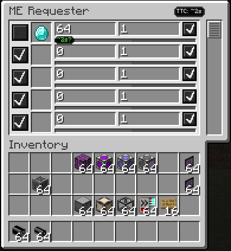

---
navigation:
  title: ME Requester
  parent: index.md
  position: 10
---

# ME Requester

With ME Requester installed on Minecraft 1.20.1 or 1.21.1, each request row can
show TTC below its amount fields and the header can total the known visible
rows. The estimate covers only the current network shortfall: requested amount
minus what is already stored.

For example, a request for 64 diamonds with 48 already stored estimates the 16
that still need crafting. If the full amount is stored, no badge is shown. If a
shortfall exists but the output has no learned throughput, the row says **No
data yet**. Visible rows use the same relative colors as AE2 screens. This
optional integration is not available on the 26.1.2 target and has no effect
when ME Requester is absent.

*A seeded diamond request shows a two-second row estimate and its total hint.*

[Previous: AE2: Crafting Tree](crafting-tree.md) | [Features](index.md) |
[Next: Addon support](addon-support.md) | [Learning throughput](learning-throughput.md)
