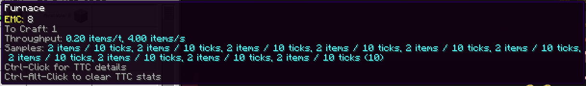

---
navigation:
  title: Saved history
  parent: index.md
  position: 7
---

# Saved history

Completed throughput samples are saved with the Minecraft world and restored
when it loads. History is scoped by AE2 network and output, so two networks in
one world do not borrow each other's machine speed. Each output keeps only the
newest configured number of samples.

For example, after learning a furnace recipe and restarting the server, its TTC
can still appear without retraining from zero. In-progress batches, delay state,
recent parallel capacity, and job-accuracy history are runtime-only because a
restart cannot preserve their timing safely. Removing an item-providing mod can
leave harmless saved entries, but those entries are not shown when the output
no longer exists. Use the reset control when you intentionally want to remove
one output's retained history.

*Seeded retained windows show the bounded history that survives a world save.*

[Previous: Details and reset](details-and-reset.md) | [Features](index.md) |
[Next: Configuration](configuration.md) | [Learning throughput](learning-throughput.md)
