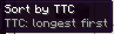

---
navigation:
  title: Sorting and colors
  parent: index.md
  position: 5
---

# Sorting and colors

Crafting Plan and Crafting Status open with **TTC: longest first** so the slowest
known work is easy to find. Use the toolbar button to cycle through AE2 order,
shortest first, and longest first. The choice lasts only while that screen is
open. Rows without an estimate stay after known rows and keep their original
relative order.

Known TTC badges are colored from green through yellow to red relative to the
other visible known times. In a list of 2, 10, and 30 seconds, the two-second
row is the fast end and the thirty-second row is the slow end. The colors compare
the current list; red does not automatically mean a delay. An actual delay uses
the separate red **DELAYED** label.

*Seeded values show longest-first order and relative fast-to-slow colors.*

[Previous: Delay diagnostics](delay-diagnostics.md) | [Features](index.md) |
[Next: Details and reset](details-and-reset.md) | [Time estimates](time-estimates.md)
