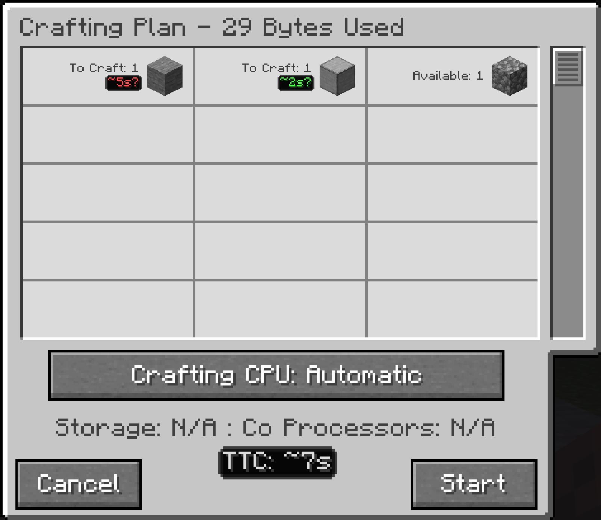

---
navigation:
  title: Time estimates
  parent: features/index.md
  position: 0
---

# Time estimates

Crafting Plan shows TTC beside every row that has learned timing data. The row
time covers the full **To Craft** amount, not one pattern operation. The total
below the CPU details adds the known plan rows; if some rows have no data, it is
only the known part of the job.

Crafting Status uses the same row estimates while a job runs. Its total follows
the longest remaining dependency path, so parallel branches are not added as if
they ran one after another. For example, two independent ten-second branches
can still finish in about ten seconds, while two dependent steps take about
twenty. Estimates are not deadlines: machine speed, other work, and server load
can change the result.

*Seeded test values show two learned recipe estimates and their known total.*

[Features](index.md) | [Next: Learning throughput](learning-throughput.md) |
[Make your first estimate](../getting-started.md)
