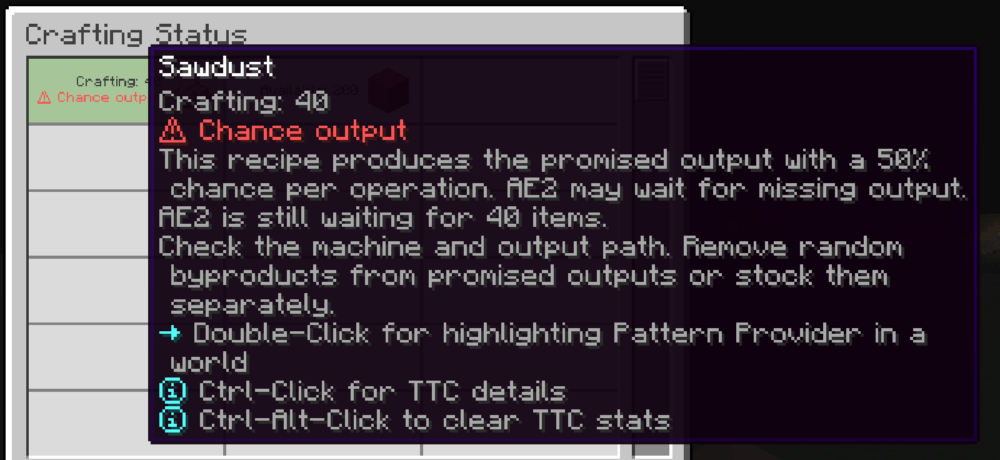

---
navigation:
  title: Chance output
  parent: statuses/index.md
  position: 8
---

# Chance output

This is an experimental diagnosis. It currently works only for the Mekanism
Precision Sawmill on Minecraft 1.20.1 Forge. Other machines may be supported
later as their live recipe chances can be verified.

**Label:** `Chance output` (normal-weight red `⚠ Chance output` with Show emoji on).

A processing pattern promises an output that the connected machine produces
only by chance. AE2 waits for the promised amount even if the machine has
already processed every input. For example, 100 attempts at 50% chance yield
about 50 items on average, but any particular job can yield fewer or more.
In a controlled example, if 100 outputs are promised and only 60 return,
AE2 still waits for 40. The 60 returns do not prove the recipe's chance.

The tooltip shows the verified per-operation chance and the outstanding amount.
Detection needs one direct Pattern Provider target, one matching live recipe,
and the recipe's chance-based secondary output encoded in the pattern. Other
machines and ambiguous patterns stay on the regular Delayed status; missing
items alone do not prove chance output.

Check the machine, output path, and inputs first. For optional random byproducts,
remove them from promised pattern outputs or supply them independently. More
inputs improve the average yield but cannot guarantee the promised amount.
Cancel and correct a job that can no longer finish.

The client **Chance output status** and server **Detect chance outputs** options
are both off by default. Turn on both to use this diagnosis. Show emoji removes
the symbol but keeps the red label. Badge background controls the row's shared
rounded background.

*A controlled return of 60 sawdust leaves AE2 waiting for 40; the live sawmill recipe has a verified 50% chance per operation.*

[Previous: Waiting](waiting.md) | [Statuses](index.md) | [Next: Delayed](delayed.md)
