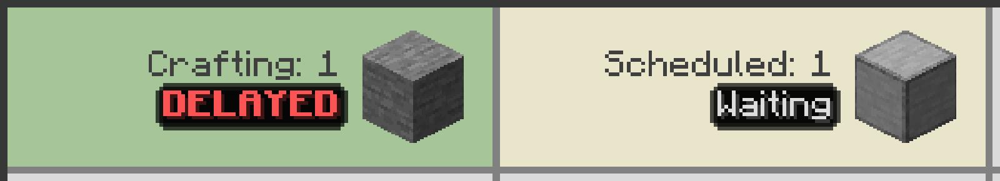

---
navigation:
  title: DELAYED
  parent: statuses/index.md
  position: 7
---

# DELAYED

**Label:** `DELAYED`

This appears on active Crafting Status rows when production stops for both 30
seconds and more than twice the learned average production interval. Scheduled
blocking labels apply to scheduled work instead.

## What to check

1. Hover the row for recent activity and capacity details.
2. Check the active machine, its output path, fuel, and required inputs.
3. Restore production, or cancel a job that cannot continue.

Any accepted output restarts the idle timer and clears the label. Finishing,
cancelling, resetting that output, or reloading also clears runtime delay state.
The threshold needs learned history, and a delay points to the recipe flow rather
than proving which machine caused it.

*A processing recipe has exceeded both parts of its learned delay threshold.*

[Previous: Waiting](waiting.md) | [Statuses](index.md) |
[Next: No data yet](no-data-yet.md) | [Delay diagnostics](../features/delay-diagnostics.md)
