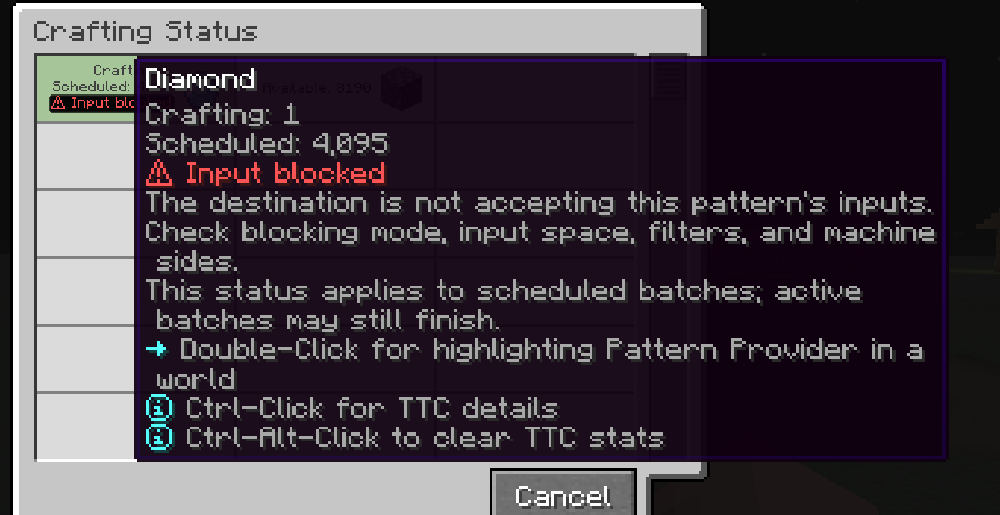

---
navigation:
  title: Input blocked
  parent: statuses/index.md
  position: 5
---

# Input blocked

**Label:** `Input blocked`

This appears on scheduled Crafting Status rows when a usable destination exists
but blocking mode or an observed insertion rejection prevents dispatch. Higher
priority reasons remain visible first. Active batches may still finish.

## What to check

1. Check the Pattern Provider's blocking mode.
2. Free input space in the destination.
3. Check filters, enabled sides, and machine input rules.

A successful, unknown, or changed evaluation clears the observation; otherwise
it expires after 20 server ticks and a refresh. Partial acceptance followed by a
successful dispatch is not blocked input. The label does not identify which
slot, side, or filter rejected the ingredients.

*The destination exists, but it is not accepting this pattern's inputs.*

[Previous: Locked](locked.md) | [Statuses](index.md) |
[Next: No target](no-target.md) | [Delay diagnostics](../features/delay-diagnostics.md)
