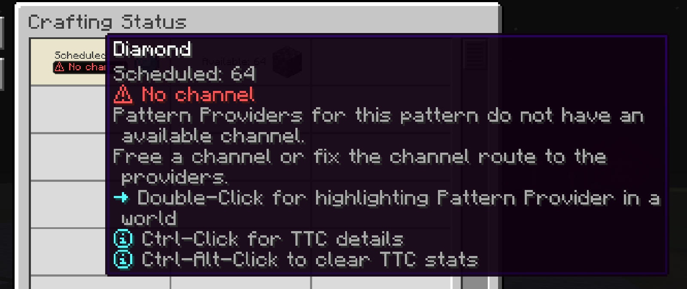

---
navigation:
  title: No channel
  parent: statuses/index.md
  position: 3
---

# No channel

**Label:** `No channel`

This appears when scheduled work reaches every provider for its exact pattern,
but each provider is powered and booted without an available channel. Before
that real dispatch attempt, the row stays at `Waiting`. An empty provider lookup
is `No provider`, while a network that cannot pay for dispatch is `No power`.

## What to check

1. Free a channel on the provider's cable branch.
2. Fix the cable route between the provider and controller.
3. Wait for the ME network to finish booting after changing the route.

A successful or inconclusive retry clears the observation immediately;
otherwise it ages out after 20 server ticks. Once the provider receives a
channel, the open Crafting Status screen recovers and the job can continue.

*The pattern is known, but its providers cannot join the channel network.*

[Previous: No power](no-power.md) | [Statuses](index.md) |
[Next: Locked](locked.md) | [Delay diagnostics](../features/delay-diagnostics.md)
