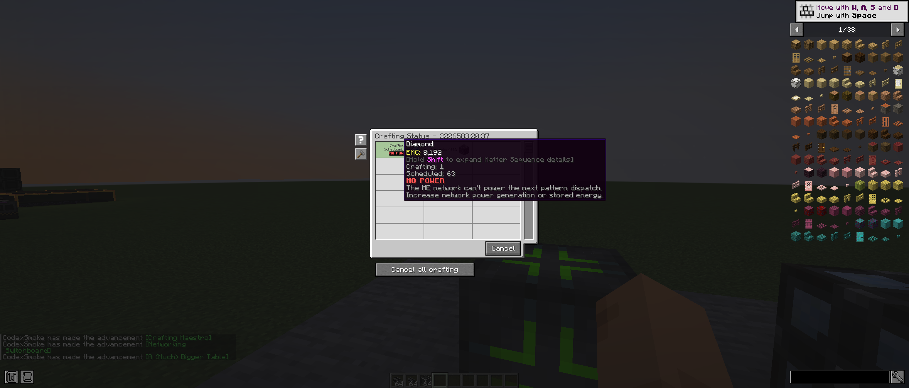

---
navigation:
  title: NO POWER
  parent: statuses/index.md
  position: 2
---

# NO POWER

**Label:** `NO POWER`

This appears on scheduled Crafting Status rows when the ME network cannot
extract enough energy for the next real pattern dispatch. `NO PROVIDER` wins if
both apply. Active batches may continue outside the network.

## What to check

1. Increase ME power generation.
2. Add or recharge network energy storage.
3. Check the powered path between the CPU, provider, and grid.

A successful power check clears the observation immediately; otherwise it ages
out after 20 server ticks and the next refresh. Server lag can make that longer
than one wall-clock second. An idle or unpowered external machine alone is not
proof of this status.

*The network has scheduled work but cannot pay the energy cost of its next dispatch.*

[Previous: NO PROVIDER](no-provider.md) | [Statuses](index.md) |
[Next: LOCKED](locked.md) | [Delay diagnostics](../features/delay-diagnostics.md)
