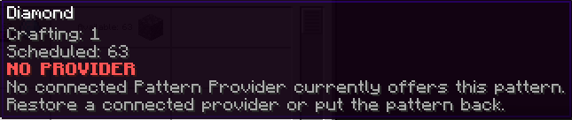

---
navigation:
  title: NO PROVIDER
  parent: statuses/index.md
  position: 1
---

# NO PROVIDER

**Label:** `NO PROVIDER`

This appears on scheduled Crafting Status rows after AE2 cannot find the exact
encoded pattern on a connected Pattern Provider. It outranks the other
scheduled blocking reasons. Active batches on the same row may still finish.

## What to check

1. Restore the provider and its network connection.
2. Put the encoded pattern back in an available provider.
3. Confirm the pattern still produces the scheduled output.

The label clears after the next status refresh finds that exact pattern again,
or when the job finishes or is cancelled. It does not name a specific provider,
and another healthy recipe for the same output does not clear the missing one.

*The active batch can finish, but the remaining scheduled batches lost their pattern.*

[Previous: NO SPACE](no-space.md) | [Statuses](index.md) |
[Next: NO POWER](no-power.md) | [Delay diagnostics](../features/delay-diagnostics.md)
