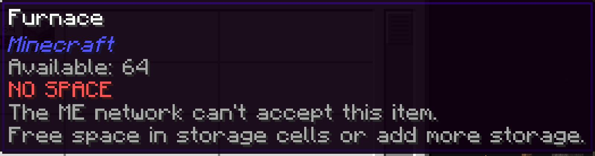

---
navigation:
  title: NO SPACE
  parent: statuses/index.md
  position: 0
---

# NO SPACE

**Label:** `NO SPACE`

This appears in Crafting Status when a CPU holds finished output that it cannot
return to writable ME storage. It has the highest status priority because the
items already exist and are waiting inside the CPU.

## What to check

1. Free space in a storage cell that accepts the item.
2. Add writable storage or fix its partition and priority.
3. Check that the CPU still has a powered path to that storage.

The label clears when the stored output enters the ME network. Adding space can
clear it while the screen remains open. It does not identify which cell is full,
and it does not mean a processing machine lacks output space.

*A retained CPU output cannot return to the full ME storage network.*

[Statuses](index.md) | [Next: NO PROVIDER](no-provider.md) |
[Delay diagnostics](../features/delay-diagnostics.md)
