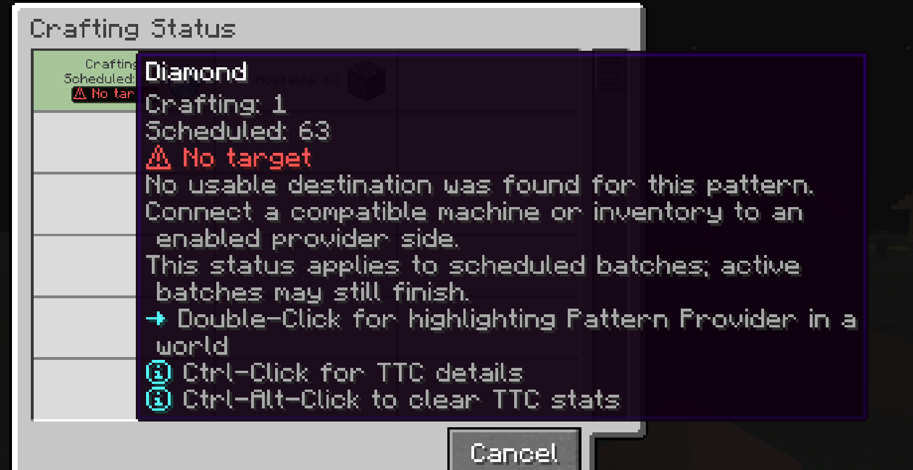

---
navigation:
  title: No target
  parent: statuses/index.md
  position: 6
---

# No target

**Label:** `No target`

This appears on scheduled Crafting Status rows after an attempted processing
dispatch finds no usable destination on any eligible provider side. All higher
priority blocking reasons win first. Active batches may still finish.

## What to check

1. Connect a compatible machine or inventory.
2. Put it on an enabled Pattern Provider side.
3. Confirm the pattern and destination type belong together.

The next successful, unknown, or changed evaluation clears the observation;
otherwise it expires after 20 server ticks and a refresh. A destination that is
present but rejects inputs is not `No target`, and busy or unvisited alternatives
do not prove this status. The state is not saved with the world.

*No compatible destination was found for the next scheduled batch.*

[Previous: Input blocked](input-blocked.md) | [Statuses](index.md) |
[Next: Waiting](waiting.md) | [Delay diagnostics](../features/delay-diagnostics.md)
